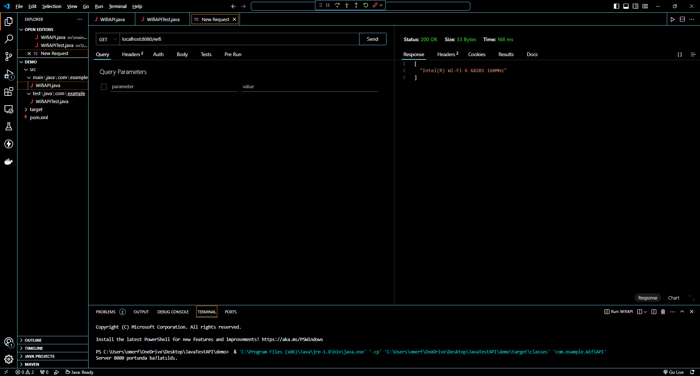

The WifiAPI class starts an HTTP server and creates the /wifi endpoint.
The handle method inside the WifiHandler class handles requests to the /wifi endpoint.
The getConnectedWifiNetworks method retrieves the names of other networks connected to the same network as you.
The names of the networks are then formatted into a JSON response and sent back to the client.